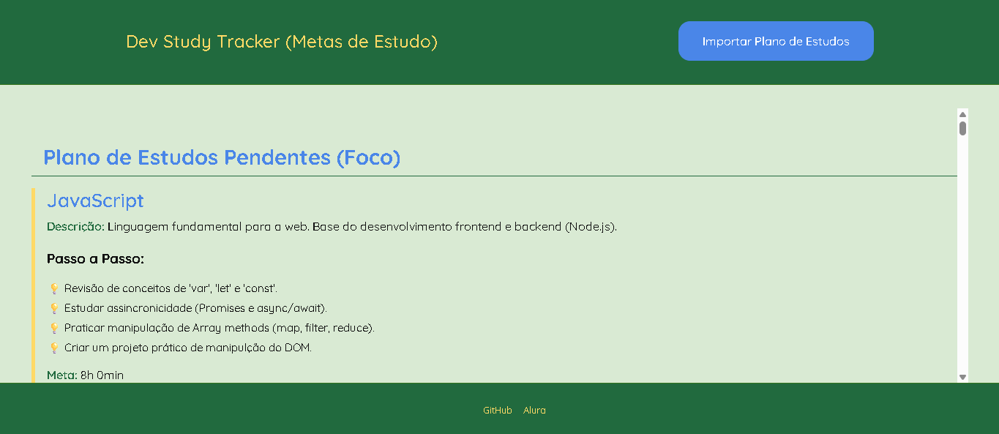

## 🚀 Dev Study Tracker: Seu Plano de Estudos Imersão Dev com Alura e Google

Este é o projeto **Dev Study Tracker**, desenvolvido durante a **Imersão Dev** em parceria com a **Alura** e o **Google**. Ele é um aplicativo web focado em ajudar estudantes a planejar, rastrear e concluir suas metas de estudo em programação, utilizando apenas os fundamentos do desenvolvimento web: **HTML, CSS e JavaScript Vanilla**.

O projeto foi criado para ser um excelente exemplo de como aplicar os conceitos básicos de manipulação do DOM e persistência de dados local (`localStorage`) para construir uma **ferramenta útil, criativa e eficaz**, um critério chave na avaliação da Imersão.

-----

### ✨ Principais Recursos e Funcionalidades

| Recurso | Descrição | Foco de Avaliação |
| :--- | :--- | :--- |
| **Importação de Planos** | O usuário pode escolher entre planos de estudo pré-definidos (Plano Base ou Plano de Linguagens de Programação), que são carregados de arquivos **JSON**. | Criatividade e Utilidade |
| **Rastreamento de Progresso** | Cada meta de estudo possui uma **Meta em Minutos** e uma contagem de tempo estudado, atualizada pelos botões de ação (**+ 15 min** / **+ 1 hora**). | Eficácia |
| **Visualização Detalhada** | Cada card exibe a descrição da tecnologia e um **Passo a Passo** detalhado para guiar o estudo. | Utilidade e Apresentação |
| **Barra de Progresso Visual** | Uma barra de progresso em amarelo fornece feedback instantâneo sobre o percentual de conclusão da meta. | Apresentação |
| **Persistência de Dados** | O progresso do usuário é automaticamente salvo no `localStorage` do navegador, garantindo que os dados não sejam perdidos ao fechar a página. | Eficácia |
| **Design Temático** | O projeto utiliza um esquema de cores vibrante (verde, azul e amarelo) e tipografia limpa, demonstrando atenção à **UI/UX** com CSS puro. | Apresentação |

-----

### 🛠️ Tecnologias Utilizadas

Este projeto foi construído estritamente com as tecnologias abordadas nos fundamentos da Imersão Dev:

  * **HTML5:** Estrutura e Semântica da Aplicação.
  * **CSS3:** Estilização, Responsividade e Layout Temático (Flexbox e Media Queries).
  * **JavaScript Vanilla (Puro):** Lógica da aplicação, Manipulação do DOM, Funções Assíncronas (`fetch`) e Persistência de Dados (`localStorage`).
  * **JSON:** Utilizado como fonte de dados para estruturar os planos de estudo (Metas, Descrições e Passos).

-----

### 🚀 Como Rodar o Projeto

Você só precisa de um navegador moderno para rodar este projeto.

1.  **Clone o Repositório:**
    ```bash
    git clone https://github.com/shakarpg/imersao-dev-study-tracker
    ```
2.  **Navegue até a Pasta:**
    ```bash
    cd dev-study-tracker
    ```
3.  **Abra no Navegador:**
    Abra o arquivo `index.html` diretamente no seu navegador.

### 💡 Primeiro Uso

Ao iniciar, você será direcionado para escolher um plano:

1.  Clique no botão **"Importar Plano de Estudos"**.
2.  Escolha uma das opções:
      * **1. Plano Base:** Focado em fundamentos (HTML, CSS, JS/DOM).
      * **2. Plano de Todas as Linguagens de Programação:** Um plano mais extenso com diversas linguagens (Python, Java, Go, Rust, etc.).
3.  O progresso do plano escolhido será exibido, e você pode começar a registrar o tempo de estudo\!

-----

### 🖼️ Preview

-----

### 🧑‍💻 Autor

Feito com 💚 e 💡 por **Rafael Pereira Galhardo**

  * **[LinkedIn]:** (https://www.linkedin.com/in/rpg2011)
  * **[GitHub]:** (https://www.github.com/shakarpg)

